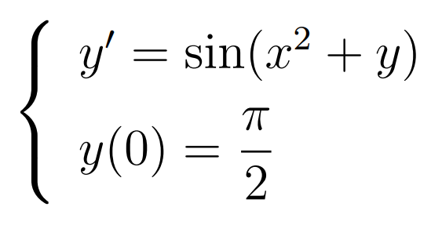
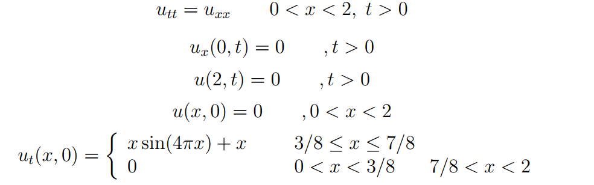
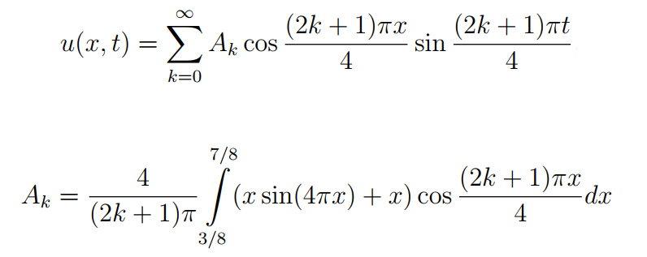
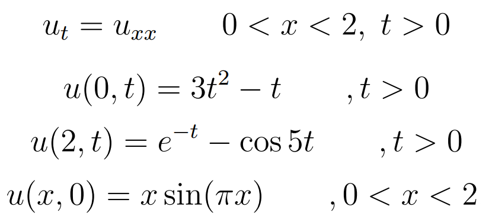

# FMI-differential-equations

Course projects for the Differential Equations and Applications course @ FMI.

## Project 1

### Problem 1

Solve the Cauchy problem, using step sizes of 0.1, 0.02 and 0.002, in the interval [0,5]. Plot the results in a single coordinate system:

### Problem 2

Find the equilibrium points of the following system:

Draw a phase portrait and classify the equilibrium points.
Make an animation of the movement of the point (x(t), y(t)) for the solution of the Cauchy problem of the system with initial conditions x(0) = -0.5 and y(0) = -1 for time in [0,4].

## Project 2

### Problem 1

Given is the following vibrating string problem:

Its solution is:

Find the partial sum of the first 42 members of the series. Animate the functions' graphs for time in [0,4], changing with step 0.08.

### Problem 2

Given the following heat equation problem:

Solve for time in [0, 0.5]. Animate it.
